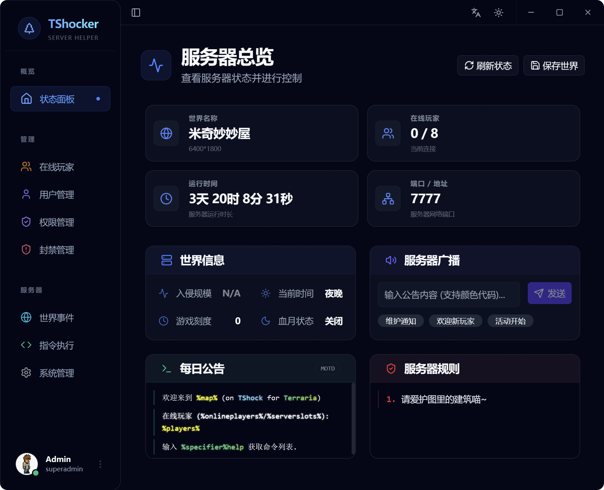
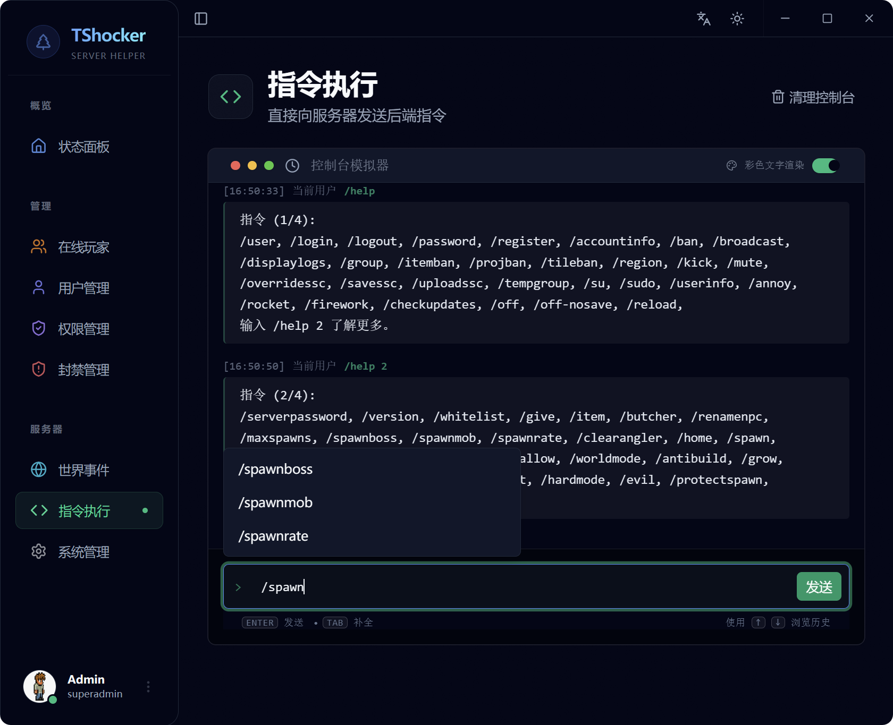

<p align="center">
  
</p>

<h1 align="center">TShocker</h1>

<p align="center">
  <strong>Desktop management client for TShock (via REST API)</strong>
</p>

<p align="center">
  <a href="https://github.com/brushax/TShocker/releases">
    
  </a>
  <a href="https://github.com/brushax/TShocker/actions/workflows/release.yml">
    
  </a>
  
  
</p>

<p align="center">
  <a href="./README.zh-CN.md">简体中文</a> | <b>English</b>
</p>

---

TShocker is a cross-platform desktop UI for managing **[TShock](https://github.com/Pryaxis/TShock)** servers. It interacts directly with the TShock REST API to provide administrative controls without needing to be in-game.

Terraria item and NPC datasets bundled in `public/data/` are generated from [Terraria Wiki.gg](https://terraria.wiki.gg/wiki/Terraria_Wiki). See [NOTICE.md](./NOTICE.md) for attribution.

## Preview

<p align="center">
  
  
</p>

## Requirements

- A running TShock server with the REST API enabled.
- A TShock account with permission to access the REST endpoints you plan to use.

## Features

- **Dashboard**: Real-time server status, world info, and uptime monitoring.
- **Player Control**: Kick, ban, mute, and toggle god-mode. Supports inventory and buff inspection.
- **Item/NPC Database**: Integrated search to give items or summon NPCs near players.
- **Permissions**: Manage TShock groups, inheritance, and permission nodes.
- **Blacklist**: Manage IP, UUID, and account bans.
- **World Events**: Trigger invasions, weather effects, and toggle autosave.
- **Console**: Built-in terminal for direct command execution with color support.
- **System**: Reload configs, save world, and server restart/shutdown.

## 🚀 Installation

### Windows

Download the latest installer from [Releases](https://github.com/brushax/TShocker/releases).

### macOS

Download the `.dmg` or `.app` from [Releases](https://github.com/brushax/TShocker/releases).

## Development

```bash
pnpm install
pnpm test
pnpm tauri dev
pnpm tauri build
```

## License

MIT
